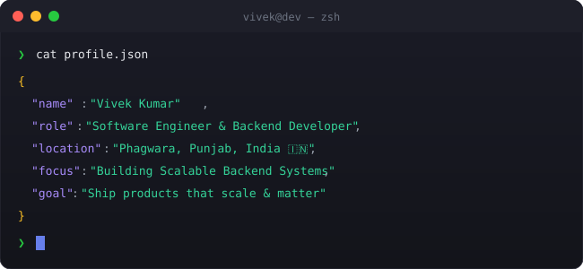

<!-- 
╔══════════════════════════════════════════════════════════════════════════════╗
║                                                                              ║
║   ██╗   ██╗██╗██╗   ██╗███████╗██╗  ██╗    ██╗  ██╗██╗   ██╗███╗   ███╗ ███╗   ║
║   ██║   ██║██║██║   ██║██╔════╝██║ ██╔╝    ██║ ██╔╝██║   ██║████╗ ████║ ████╗  ║
║   ██║   ██║██║██║   ██║█████╗  █████╔╝     █████╔╝ ██║   ██║██╔████╔██║ ██╔██╗ ║
║   ╚██╗ ██╔╝██║╚██╗ ██╔╝██╔══╝  ██╔═██╗     ██╔═██╗ ██║   ██║██║╚██╔╝██║ ██║╚██╗║
║    ╚████╔╝ ██║ ╚████╔╝ ███████╗██║  ██╗    ██║  ██╗╚██████╔╝██║ ╚═╝ ██║ ██║ ╚██║
║     ╚═══╝  ╚═╝  ╚═══╝  ╚══════╝╚═╝  ╚═╝    ╚═╝  ╚═╝ ╚═════╝ ╚═╝     ╚═╝ ╚═╝  ╚═╝
║                                                                              ║
║         🚀 SOFTWARE ENGINEER • BACKEND DEVELOPER • PROBLEM SOLVER 🚀         ║
║                                                                              ║
╚══════════════════════════════════════════════════════════════════════════════╝
-->

<div align="center">
  
  <!-- ═══════════════════════════════════════════════════════════════════════════ -->
  <!-- 🎯 ANIMATED HEADER                                                          -->
  <!-- ═══════════════════════════════════════════════════════════════════════════ -->
  
  
  
  <br/>
  
  <!-- ═══════════════════════════════════════════════════════════════════════════ -->
  <!-- 📊 PROFILE BADGES                                                           -->
  <!-- ═══════════════════════════════════════════════════════════════════════════ -->
  
  <a href="https://github.com/Vroy4298">
    
  </a>
  &nbsp;
  <a href="https://github.com/Vroy4298?tab=repositories">
    
  </a>
  &nbsp;
  <a href="https://github.com/Vroy4298?tab=followers">
    
  </a>
  &nbsp;
  <a href="https://github.com/Vroy4298">
    
  </a>
  
</div>

<br/>

<!-- ═══════════════════════════════════════════════════════════════════════════ -->
<!-- 🖥️ TERMINAL INTRO SECTION                                                   -->
<!-- ═══════════════════════════════════════════════════════════════════════════ -->

<div align="center">
  
</div>

<br/>


<br/>

<!-- ═══════════════════════════════════════════════════════════════════════════ -->
<!-- 👤 ABOUT ME SECTION                                                          -->
<!-- ═══════════════════════════════════════════════════════════════════════════ -->


<br/><br/>

<table>
<tr>
<td width="55%" valign="top">

### 🎯 What I Do

```yaml
name: Vivek Kumar
located_in: Phagwara, Punjab, India 🇮🇳
current_status: Student & Software Engineer

areas_of_expertise:
  - ⚙️  Backend Engineering (Node.js, Express.js)
  - 🗄️  Databases (MongoDB, MySQL, Redis)
  - ⚛️  Frontend (React.js, Next.js, Tailwind CSS)
  - ☁️  Cloud & DevOps (Docker, AWS, Vercel, Render)
  - 🤖 AI Integration (OpenAI GPT-4, REST APIs)

currently_building:
  - LeaveLoop – AI-Powered HR Management System
  - Land Tax Management & Automation Platform
  - Interactive Wall Calendar (Generative Design)

life_philosophy: "Build systems that scale. Solve problems that matter."
```

</td>
<td width="45%" valign="top">

### 🚀 Current Focus

- ⚙️  **Architecting** scalable backend systems
- 🤖 **Integrating** AI APIs into real products
- ☁️  **Deploying** production apps on AWS & Vercel
- 🌟 **Contributing** to open-source (GSSoC 2026)
- 📚 **Learning** Go & system design patterns
- 🏆 **Earning** Oracle Cloud certifications

<br/>

### 💡 Quick Facts

- 🎓 B.Tech CSE @ Lovely Professional University
- 🔥 Passionate about backend & system optimization
- 🌱 Always exploring new tech & cloud tools
- ☕ Fueled by coffee & clean architecture

</td>
</tr>
</table>

<br/>


<br/>

<!-- ═══════════════════════════════════════════════════════════════════════════ -->
<!-- 🏆 ACHIEVEMENTS SECTION                                                     -->
<!-- ═══════════════════════════════════════════════════════════════════════════ -->


<br/><br/>

<div align="center">
  
  <!-- GitHub Trophies -->
  <a href="https://github.com/ryo-ma/github-profile-trophy">
    
  </a>
  
</div>

<br/>


<br/>

<!-- ═══════════════════════════════════════════════════════════════════════════ -->
<!-- 📊 GITHUB ANALYTICS                                                         -->
<!-- ═══════════════════════════════════════════════════════════════════════════ -->


<br/><br/>

<div align="center">
  
  <!-- GitHub Stats + Custom Streak in ONE ROW -->
  <a href="https://github.com/Vroy4298">
    
  </a>
  &nbsp;
  <a href="https://github.com/Vroy4298">
    
  </a>
  
  <br/><br/>
  
  <!-- 📊 REAL-TIME LANGUAGE USAGE WITH PROGRESS BARS -->
  <a href="https://github.com/Vroy4298">
    
  </a>
  
  <br/><br/>
  
  <!-- Activity Graph -->
  <a href="https://github.com/Vroy4298">
    
  </a>
  
  <br/><br/>
  
  <!-- Additional Stats Cards -->
  
  
</div>

<br/>


<br/>

<!-- ═══════════════════════════════════════════════════════════════════════════ -->
<!-- 🎮 CONTRIBUTION SHOWCASE                                                    -->
<!-- ═══════════════════════════════════════════════════════════════════════════ -->


<br/><br/>

<div align="center">
  
  <!-- Pac-Man Contribution Graph -->
  <picture>
    <source media="(prefers-color-scheme: dark)" srcset="./assets/pacman-contribution-graph-dark.svg"/>
    <source media="(prefers-color-scheme: light)" srcset="./assets/pacman-contribution-graph.svg"/>
    
  </picture>
  
  <br/>
  
  <sub>👾 Watch Pac-Man devour my contributions!</sub>
  
</div>

<br/>


<br/>

<!-- ═══════════════════════════════════════════════════════════════════════════ -->
<!-- ⚡ TECH STACK                                                               -->
<!-- ═══════════════════════════════════════════════════════════════════════════ -->


<br/><br/>

<div align="center">

<!-- 💻 LANGUAGES -->
<h4>💻 Languages</h4>
<p>
  <a href="https://isocpp.org/" target="_blank"></a>
  <a href="https://en.wikipedia.org/wiki/C_(programming_language)" target="_blank"></a>
  <a href="https://developer.mozilla.org/en-US/docs/Web/JavaScript" target="_blank"></a>
  <a href="https://www.typescriptlang.org/" target="_blank"></a>
  <a href="https://go.dev/" target="_blank"></a>
  <a href="https://www.gnu.org/software/bash/" target="_blank"></a>
</p>

<!-- 🌐 WEB DEVELOPMENT -->
<h4>🌐 Web Development</h4>
<p>
  <a href="https://nodejs.org/" target="_blank"></a>
  <a href="https://expressjs.com/" target="_blank"></a>
  <a href="https://reactjs.org/" target="_blank"></a>
  <a href="https://nextjs.org/" target="_blank"></a>
  <a href="https://tailwindcss.com/" target="_blank"></a>
  <a href="https://developer.mozilla.org/en-US/docs/Web/HTML" target="_blank"></a>
  <a href="https://developer.mozilla.org/en-US/docs/Web/CSS" target="_blank"></a>
</p>

<!-- 🗄️ DATABASES -->
<h4>🗄️ Databases</h4>
<p>
  <a href="https://www.mongodb.com/" target="_blank"></a>
  <a href="https://www.mysql.com/" target="_blank"></a>
  <a href="https://redis.io/" target="_blank"></a>
  <a href="https://firebase.google.com/" target="_blank"></a>
  <a href="https://www.sqlite.org/" target="_blank"></a>
</p>

<!-- ☁️ DEVOPS & CLOUD -->
<h4>☁️ DevOps & Cloud</h4>
<p>
  <a href="https://www.docker.com/" target="_blank"></a>
  <a href="https://aws.amazon.com/" target="_blank"></a>
  <a href="https://vercel.com/" target="_blank"></a>
  <a href="https://www.linux.org/" target="_blank"></a>
  <a href="https://git-scm.com/" target="_blank"></a>
</p>

<!-- 🔧 TOOLS & PLATFORMS -->
<h4>🔧 Tools & Platforms</h4>
<p>
  <a href="https://code.visualstudio.com/" target="_blank"></a>
  <a href="https://www.postman.com/" target="_blank"></a>
  <a href="https://www.figma.com/" target="_blank"></a>
</p>

</div>

<br/>


<br/>

<!-- ═══════════════════════════════════════════════════════════════════════════ -->
<!-- 🔥 CURRENTLY WORKING ON                                                     -->
<!-- ═══════════════════════════════════════════════════════════════════════════ -->

<div align="center">
  
### ⚡ Currently Building & Learning

<br/>

<a href="https://github.com/Vroy4298">
  
</a>
&nbsp;
<a href="https://github.com/Vroy4298">
  
</a>
&nbsp;
<a href="https://github.com/Vroy4298">
  
</a>

</div>

<br/>


<br/>

<!-- ═══════════════════════════════════════════════════════════════════════════ -->
<!-- 🌐 CONNECT WITH ME                                                          -->
<!-- ═══════════════════════════════════════════════════════════════════════════ -->


<br/><br/>

<div align="center">
  
<a href="https://github.com/Vroy4298" target="_blank">
  
</a>
&nbsp;
<a href="https://linkedin.com/in/vivekkumar123" target="_blank">
  
</a>
&nbsp;
<!-- 👇 ADD YOUR FACEBOOK URL BELOW (replace YOUR_FACEBOOK_USERNAME) -->
<a href="https://fb.com/YOUR_FACEBOOK_USERNAME" target="_blank">
  
</a>
&nbsp;
<!-- 👇 ADD YOUR INSTAGRAM HANDLE BELOW (replace YOUR_INSTAGRAM_HANDLE) -->
<a href="https://instagram.com/YOUR_INSTAGRAM_HANDLE" target="_blank">
  
</a>
&nbsp;
<a href="mailto:vivekkumar.dev541@gmail.com">
  
</a>

</div>

<br/>


<br/>

<!-- ═══════════════════════════════════════════════════════════════════════════ -->
<!-- 💡 RANDOM DEV QUOTE                                                         -->
<!-- ═══════════════════════════════════════════════════════════════════════════ -->

<div align="center">
  
### 💭 Random Dev Quote

<br/>

<a href="https://github.com/Vroy4298">
  
</a>

</div>

<br/>

<!-- ═══════════════════════════════════════════════════════════════════════════ -->
<!-- 🌟 FOOTER                                                                   -->
<!-- ═══════════════════════════════════════════════════════════════════════════ -->

<div align="center">
  
  
  
  <br/>
  
  <!-- ☕ BUY ME A COFFEE — replace YOUR_BMC_USERNAME with your buymeacoffee username -->
  <a href="https://buymeacoffee.com/YOUR_BMC_USERNAME" target="_blank">
    
  </a>
  
  <br/><br/>
  
  
  
</div>

<!-- ═══════════════════════════════════════════════════════════════════════════ -->
<!-- 📝 END OF README                                                            -->
<!-- ═══════════════════════════════════════════════════════════════════════════ -->
